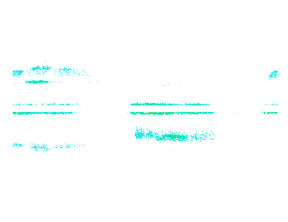
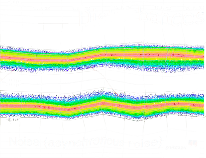
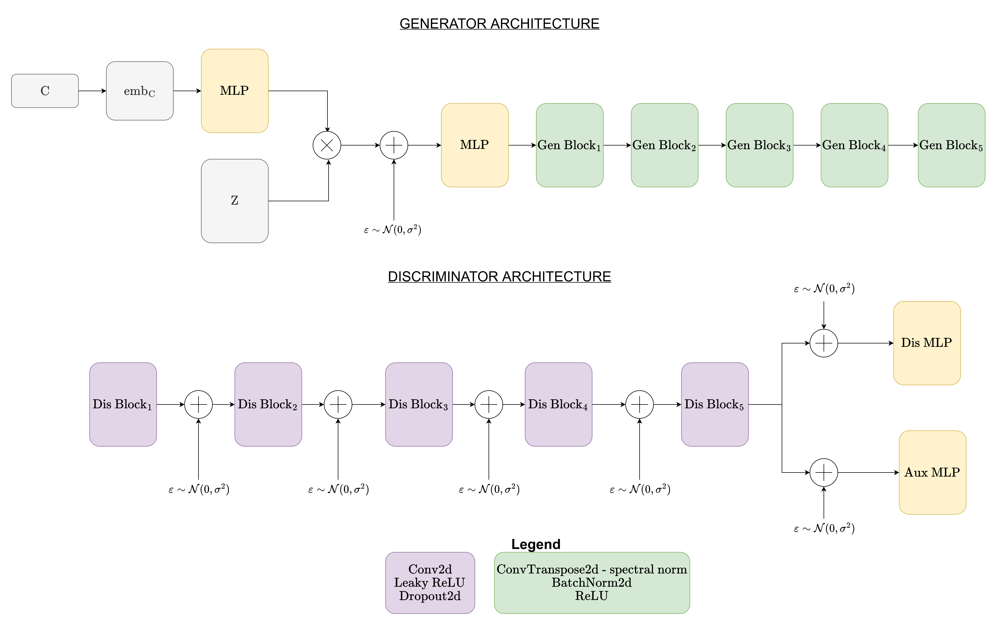
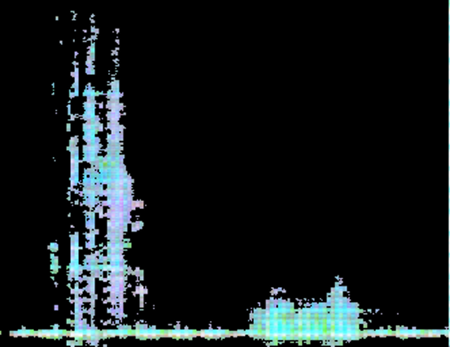
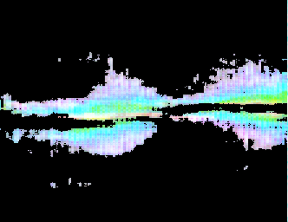
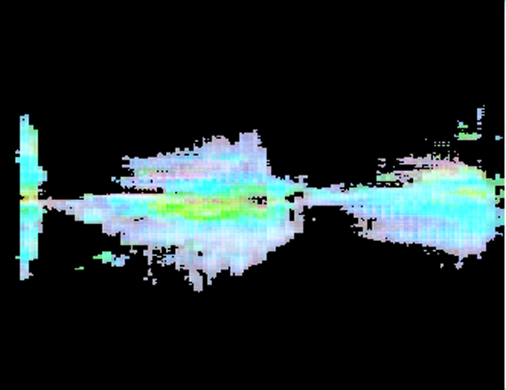

# `Geração e Avaliação de Dados Sintéticos para PRPD`
# `Generation and Evaluation of Synthetic Data for PRPD`

## Apresentação

O presente projeto foi originado no contexto das atividades da disciplina de pós-graduação *IA376N - IA generativa: de modelos a aplicações multimodais*, 
oferecida no segundo semestre de 2024, na Unicamp, sob supervisão da Profa. Dra. Paula Dornhofer Paro Costa, do Departamento de Engenharia de Computação e Automação (DCA) da Faculdade de Engenharia Elétrica e de Computação (FEEC).

> |Nome  | RA | Especialização|
> |--|--|--|
> | José Alfredo Zapana García | 272291 | Aluno de mestrado em Eng. Elétrica |
> | Sílvia Claudino Martins Gomes | 271629  | Aluna Especial |

## Resumo (Abstract)

A fase-resolvida de descargas parciais (PRPD) é uma representação gráfica da atividade de descargas parciais (PD) ao longo dos 360º de um ciclo de corrente alternada (CA). Essa técnica é amplamente utilizada no diagnóstico de falhas em equipamentos de alta potência (HV), como motores elétricos, transformadores e sistemas de distribuição de energia. A análise de PRPD não só permite a detecção precoce de falhas potenciais, mas também fornece informações valiosas sobre a natureza e a gravidade das descargas parciais. Apesar de haver fontes que relacionam tipos de falhas a suas representações gráficas, encontrar bases de dados com alto volume de dados e de qualidade torna-se difícil, devido à questões de privacidade, accesibilidade a equipamentos e por ser um tema de pesquisa altamente especifico. No entanto, grandes quantidades de dados são necessárias para treinar eficazmente modelos de deep learning. Dada a escassez de bases de dados apropriadas, a geração sintética de imagens surge como uma solução promissora. Este projeto busca desenvolver e avaliar modelos generativos de imagens de PRPD, com o intuito de aumentar a quantidade e diversidade de dados disponíveis.

## Descrição do Problema/Motivação

Phase-Resolved Partial Discharge (PRPD) é uma representação gráfica da atividade de descargas parciais (PD) ao longo dos 360º de um ciclo de corrente alternada (CA), amplamente utilizada no diagnóstico de falhas em equipamentos de alta potência (HV), por ex. motores elétricos. Normalmente, essas descargas parciais têm um efeito negativo, reduzindo o ciclo de vida útil e o desempenho dos equipamentos. Elas afetam os isolamentos, comprometendo sua integridade e, em alguns casos, podem resultar em curtos-circuitos nos distribuidores de energia elétrica, levando a interrupções no serviço e custos elevados de manutenção. A análise de PRPD não só permite a detecção precoce de falhas potenciais, mas também fornece informações valiosas sobre a natureza e a gravidade das descargas parciais. Embora existam fontes que apresentam tipos de falhas e suas representações gráficas, é difícil encontrar bases de dados de qualidade, devido à natureza especializada dos dados, conflitos por segurança e privacidade, acesso aos equipamentos, etc. Além disso, grandes conjuntos de dados são necessários para treinar modelos de deep learning de forma eficaz. Dada a escassez de bases de dados adequadas, a geração sintética de imagens se apresenta como uma solução viável para esse problema. 
[Link para o slide](https://docs.google.com/presentation/d/10h3jkcC1OpaIp1o4AaWeLi4mIFBhb0lt0KU67_mCWE8/edit?usp=sharing)

## Objetivo

### Objetivo Principal
O objetivo principal deste projeto é o desenvolvimento e avaliação de modelos generativos de imagens de PRPD. Dessa forma, será possível aumentar a variabilidade e o número de dados disponíveis. 

#### Objetivos Secundários
- Implementar e adaptar modelos generativos artificiais para sintetizar padrões de PRPD.
- Realizar uma busca para otimizar os hiperparâmetros dos modelos.
- Avaliar os modelos por meio de métricas quantitativas e qualitativas.
- Determinar qual modelo está melhor condicionado para a tarefa de gerar PRPDs sintéticos.

## Metodologia

### Bases de Dados e Evolução

Para o desenvolvimento deste projeto, serão geradas imagens sintéticas com base em um conjunto de dados existente. O conjunto selecionado é proveniente do artigo "Dataset of phase-resolved images of internal, corona, and surface partial discharges in electrical generators", que contém imagens relacionadas a três tipos principais de falhas em motores elétricos: Corona, Internal e Surface, além de algumas imagens que representam ruídos. A seguir será apresentada a tabela com as principais informações da base de dados.

| Base de Dados | Endereço na Web | Resumo                                                             |
|------------|-----------------------|---------------------------------------------------------------------|
| Images of Resolved Phase Patterns of Partial Discharges in Electric Generators | https://data.mendeley.com/datasets/xz4xhrc4yr/8 | Este conjunto de dados contém imagens de padrões de fase resolvidos de descargas parciais tipo corona, superficiais e internos obtidos de geradores elétricos localizados na Colombia e um simulador de descargas parciais de Omycron Energy.|

A escolha desse dataset se justifica por sua qualidade e relevância no contexto de estudo de descargas parciais, oferecendo uma base sólida para a criação de dados sintéticos. A tabela a seguir resume a quantidade de imagens por tipo de falha:
| Tipo de DP | Quantidade de Imagens | Exemplo                                                             |
|------------|-----------------------|---------------------------------------------------------------------|
| Corona     | 308                   |                               |
| Internal   | 321                   |                           |
| Surface    | 316                   |                             |
| Noise      | 5                     |                                 |
| **Total**  | 950                   |                                                                     |

A imagem dos dataset possui tamanho de 640 x480 pixels. As anotações são pelo defeito do motor. A seguir é apresentada a quantidade percentual de cada tipo de defeito nos dados. 

Foi realizada a divisão por tipo de motor anotado. Dessa forma, a representação do mesmo motor não estará no conjunto de teste e treino, evitando *data leakage*. Posteriormente há o gráfico da quantidade de cada motor por defeito analisado. 

Adicionalmente, se realizou uma análise de variabilidade intra-classe e inter-classe por meio da métrica MS-SSIM para entender a complexidade do dataset

|            | Corona                | Internal         | Surface       |
|------------|-----------------------|------------------|----------------
| Corona     | 0.584                 | 0.495            | 0.393               |
| Internal   | 0.495                 | 0.444            | 0.404|
| Surface    | 0.393                 | 0.404            | 0.390|

### Separação de dados
O dataset será separado em três grupos: treino, validação e teste. O primeiro conjunto será utilizado para treinar as arquiteturas escolhidas, o segundo para otimizar os hiperparâmetros, e o terceiro para avaliar o desempenho dos modelos treinados.

### Modelos generativos
Para a geração dessas imagens, acredita-se que os modelos mais adequados sejam o Generative Adversarial Network (GAN) e o Variational Autoencoder (VAE), uma vez que essas arquiteturas têm se mostrado eficazes na geração de dados sintéticos em cenários semelhantes. O GAN é conhecido por sua capacidade de criar imagens realistas, enquanto o VAE oferece uma abordagem mais interpretável e robusta para a geração de variações plausíveis dos dados.

### Workflow

O *workflow* a seguir apresenta as etapas necessárias para desenvolvimento de modelos de geração de sinais sintéticos no contexto de análise de falhas.

## Experimentos, Resultados e Discussão dos Resultados

### InfoGAN

### Difussion Model

### ACWGAN-SN

O modelo que consiguiu obter resultados satisfatórios foi uma versão da ACGAN com penalidade de gradiente de Wasserstein no Discriminador e normalização espectral no Gerador.

As funções de perda para o gerador e o discriminador foram os seguintes:

$L_{\text{CE}} = - \sum_{i=1}^{C} y_i \log(\hat{y}_i)$

$L_{D}^{ACWGAN} = -\mathbb{E}_{x \sim p_{d}}[D(x)] + \mathbb{E}_{\hat{z} \sim p_{g}}[D(\hat{x})] + \lambda\mathbb{E}_{\hat{x} \sim p_{g}} \left[(\| \nabla D(\alpha{x} + (1-\alpha\hat{x}) \|_2 - 1)^2 \right] + \lambda_{cls}{L_{\text{CE}}{(D_{aux}(x),C))}} + {L_{\text{CE}}{(D_{aux}(\hat{x}),\hat{C}))}}$

$L_{G}^{ACWGAN} = -\mathbb{E}_{\hat{z} \sim p_{g}}[D(\hat{x})] + {L_{\text{CE}}{(D_{aux}(\hat{x}),\hat{C}))}}$

#### Modelo Original

##### Gerador
| Component       | Details                                                                                                 |
|------------------|--------------------------------------------------------------------------------------------------------|
| Embedding       | Sequential: Embedding(3, 10), GaussianNoise()                                                          |
| FC Embedding    | Linear(in_features=10, out_features=256, bias=False)                                                   |
| FC Latent       | Sequential: GaussianNoise(), Linear(in_features=256, out_features=400, bias=False)                     |
| Block C1        | spectral_norm ConvTranspose2d(400, 256, kernel_size=(4, 4), stride=(4, 4), bias=False) BatchNorm2d(256) ReLU()  |
| Block C2        | spectral_norm ConvTranspose2d(256, 128, kernel_size=(8, 8), stride=(4, 4), padding=(2, 2), bias=False) BatchNorm2d(128) ReLU() |
| Block C3        | spectral_norm ConvTranspose2d(128, 64, kernel_size=(8, 8), stride=(4, 4), padding=(2, 2), bias=False) BatchNorm2d(64) ReLU()  |
| Block C4        | spectral_norm ConvTranspose2d(64, 32, kernel_size=(4, 4), stride=(2, 2), padding=(1, 1), bias=False) BatchNorm2d(32) ReLU()  |
| Block C5        | spectral_norm ConvTranspose2d(32, 3, kernel_size=(4, 3), stride=(2, 3), padding=(1, 26)) Tanh()                   |
| Parameters      | **4399713**                       

##### Discriminador

| Component       | Details                                                                                                 |
|------------------|--------------------------------------------------------------------------------------------------------|
| Block C1        | GaussianNoise() Conv2d(3, 32, kernel_size=(8, 8), stride=(4, 4), padding=(2, 2), bias=False) LeakyReLU() Dropout2d() |
| Block C2        | GaussianNoise() Conv2d(32, 64, kernel_size=(8, 8), stride=(4, 4), padding=(2, 2), bias=False) LeakyReLU() Dropout2d() |
| Block C3        | GaussianNoise() Conv2d(64, 128, kernel_size=(4, 4), stride=(2, 2), padding=(1, 1), bias=False) LeakyReLU() Dropout2d() |
| Block C4        | GaussianNoise() Conv2d(128, 256, kernel_size=(4, 4), stride=(2, 2), padding=(1, 1), bias=False) LeakyReLU() Dropout2d() |
| Block C5        | GaussianNoise() Conv2d(256, 512, kernel_size=(4, 4), stride=(2, 2), padding=(1, 1), bias=False) LeakyReLU() Dropout2d() |
| Block Dis       | GaussianNoise() Linear(in_features=2048, out_features=1, bias=True)                                 |
| Block Aux       | GaussianNoise() Linear(in_features=2048, out_features=3, bias=True)                                 |
| Parameters      | **2897924**                                                                                            |

#### Hiperparâmetros

Os hiperparâmetros que foram usados durante o treinamento são os seguintes:

- (&beta;1, &beta;2) = (0, 0.999)
- batch size = 64
- epochs = 3000
- &lambda; = 10
- $\lambda_{cls}$ = 20 
- lr = 0.0002
- n embedding = 10
- z dimm = 256
- Gaussian Noise std = 0.1
- noise decay = 0.995
- Dropout rate = 0.5
- Leaky ReLU slope = 0.2
- Batch size = 64
- Tamanho das imagens = (256, 332, 3)

#### Ablation Study

#### Modelo Original

|    | FID        | KID      | P&R           | FID1       | FID2       | FID3       | KID1      | KID2      | KID3      | P&R1         | P&R2         | P&R3         | MOD3 |
|---------|------------|----------|---------------|------------|------------|------------|-----------|-----------|-----------|---------------|---------------|---------------|------|
| Train   | 159.71 | 0.105 | (0.0049,0.0000) | 172.674213 | 184.229298 | 207.838089 | 0.135167  | 0.127615  | 0.176035  | (0.0000,0.0000) | (0.0059,0.0000) | (0.0215,0.0000) |      |
| Val     | 174.95 | 0.094 | (0.5967,0.0000) | 176.923227 | 202.807142 | 240.696508 | 0.128564  | 0.099677  | 0.183579  | (0.7175,0.0000) | (0.8754,0.0000) | (0.7147,0.0000) |      |
| Test    | 221.68 | 0.179 | (0.0010,0.0000) | 265.188173 | 283.617005 | 266.801814 | 0.344515  | 0.302050  | 0.299347  | (0.0000,0.0000) | (0.0000,0.0000) | (0.0031,0.0000)|      |

#### Penalizaçao por Wasserstein

|         | FID        | KID      | P&R           | FID1       | FID2       | FID3       | KID1      | KID2      | KID3      | P&R1         | P&R2         | P&R3         | MOD3 |
|---------|------------|----------|---------------|------------|------------|------------|-----------|-----------|-----------|---------------|---------------|---------------|------|
| Train   | 290.60     | 0.268    | (0.0000,0.0000) | 280.444725 | 288.940699 | 309.726250 | 0.313640  | 0.282250  | 0.325883  | (0.0000,0.0000) | (0.0000,0.0000) | (0.0000,0.0000) |      |
| Val     | 293.99     | 0.265    | (0.0000,0.0000) | 287.282253 | 299.069478 | 313.793774 | 0.333442  | 0.264077  | 0.328807  | (0.6406,0.0000) | (0.9781,0.0345) | (0.7117,0.0714) |      |
| Test    | 288.49     | 0.302    | (0.0000,0.0000) | 241.880872 | 321.797007 | 316.801898 | 0.365371  | 0.445290  | 0.440961  | (0.0000,0.0000) | (0.0000,0.0000) | (0.0000,0.0000) |      |

#### Ruído Gaussiano no Discriminador

|    | FID        | KID      | P&R           | FID1       | FID2       | FID3       | KID1      | KID2      | KID3      | P&R1         | P&R2         | P&R3         | MOD3 |
|---------|------------|----------|---------------|------------|------------|------------|-----------|-----------|-----------|---------------|---------------|---------------|------|
| Train   | 143.241.037 | 0.086224 | (0.2832,0.0013) | 183.954.051 | 180.917.254 | 163.615.821 | 0.144840 | 0.113382 | 0.124975 | (0.3607,0.0000) | (0.2751,0.0000) | (0.1617,0.0000) |      |
| Val     | 168.473.768 | 0.084379 | (0.6250,0.0118) | 216.852.641 | 217.768.535 | 194.649.687 | 0.165530 | 0.099961 | 0.118446 | (0.9648,0.0000) | (0.7679,0.0000) | (0.6377,0.0000) |      |
| Test    | 192.640.402 | 0.134054 | (0.0127,0.0000) | 284.380.472 | 248.441.158 | 212.888.935 | 0.369825 | 0.205304 | 0.214673 | (0.0000,0.0000) | (0.0000,0.0000) | (0.0000,0.0000) |      |

##### Resultados do Defeito de Coroa

##### Resultados do Defeito Interno

##### Resultados do Defeito de Superfície

#### Ruído Gaussiano no Gerador

|    | FID        | KID      | P&R           | FID1       | FID2       | FID3       | KID1      | KID2      | KID3      | P&R1         | P&R2         | P&R3         | MOD3 |
|---------|------------|----------|---------------|------------|------------|------------|-----------|-----------|-----------|---------------|---------------|---------------|------|
| Train   | 164.65 | 0.108 | (0.0020,0.0000) | 159.649909 | 194.616374 | 219.718140 | 0.132975  | 0.139477  | 0.194397  | (0.0000,0.0000) | (0.0000,0.0000) | (0.0199,0.0000) |      |
| Val     | 183.46 | 0.102 | (0.5410,0.0118) | 178.491791 | 212.824949 | 247.799486 | 0.140242  | 0.112723  | 0.199009  | (0.7049,0.0000) | (0.9045,0.0000) | (0.8046,0.0000) |      |
| Test    | 224.94 | 0.180 | (0.0000,0.0104) | 258.469314 | 275.457409 | 273.606913 | 0.324978  | 0.305368  | 0.317812  | (0.0000,0.0000) | (0.0000,0.0312) | (0.0000,0.0000) |      |

#### Normalizaçao Espectral

|  | FID        | KID      | P&R           | FID1       | FID2       | FID3       | KID1      | KID2      | KID3      | P&R1         | P&R2         | P&R3         | 
|---------|------------|----------|---------------|------------|------------|------------|-----------|-----------|-----------|---------------|---------------|---------------|
| Train   | 170.996.605 | 0,102736 | (0.2812,0.0000) | 293.775.102 | 232.025.363 | 245.501.314 | 0,362067 | 0,203655 | 0,273549 | (0.0000,0.0000) | (0.0031,0.0000) | (0.0000,0.0000) |      
| Val     | 191.818.868 | 0,100242 | (0.4736,0.0000) | 212.507.233 | 228.128.554 | 238.886.100 | 0,168298 | 0,119335 | 0,175691 | (0.7160,0.0000) | (0.8696,0.0000) | (0.4636,0.0000) |      
| Test    | 208.008.298 | 0,150208 | (0.0020,0.0000) | 185.499.858 | 201.195.731 | 216.606.640 | 0,153220 | 0,139393 | 0,178365 | (0.5136,0.0000) | (0.2453,0.0000) | (0.0054,0.0000) |      

##### Resultados do Defeito de Coroa

Citar a grande quantidade de imagens pretas

##### Resultados do Defeito Interno

##### Resultados do Defeito de Superfície

#### Comparação dos modelos

Métricas no conjunto de Validação

| Modelo   | FID        | KID      | P&R           | FID1       | FID2       | FID3       | KID1      | KID2      | KID3      | P&R1         | P&R2         | P&R3         |
|---------|------------|----------|---------------|------------|------------|------------|-----------|-----------|-----------|---------------|---------------|---------------|
| Original     | 174.95 | 0.094 | (0.5967,0.0000) | **176.923227** | **202.807142** | 240.696508 | **0.128564**  | **0.099677**  | 0.183579  | (0.7175,0.0000) | (0.8754,0.0000) | (0.7147,0.0000) |      |
| Sem PG     | 293.99     | 0.265    | (0.0000,0.0000) | 287.282253 | 299.069478 | 313.793774 | 0.333442  | 0.264077  | 0.328807  | (0.6406,0.0000) | (**0.9781**,**0.0345**) | (0.7117,**0.0714**) |      |
| Sem Ruído no Discriminador     | **168.473768** | **0.084379** | (**0.6250**,**0.0118**) | 216.852.641 | 217.768.535 | **194.649.687** | 0.165530 | **0.099961** | **0.118446** | (**0.9648**,0.0000) | (0.7679,0.0000) | (0.6377,0.0000) |      |
| Sem Ruído no Gerador    | 183.46 | 0.102 | (0.5410,**0.0118**) | 178.491791 | 212.824949 | 247.799486 | 0.140242  | 0.112723  | 0.199009  | (0.7049,0.0000) | (0.9045,0.0000) | (**0.8046**,0.0000) |      |
| Sem Normalizaçao Espectral     | 191.818.868 | 0,100242 | (0.4736,0.0000) | 212.507.233 | 228.128.554 | 238.886.100 | 0,168298 | 0,119335 | 0,175691 | (0.7160,0.0000) | (0.8696,0.0000) | (0.4636,0.0000) |      

Métricas no conjunto de Teste
| Modelo   | FID        | KID      | P&R           | FID1       | FID2       | FID3       | KID1      | KID2      | KID3      | P&R1         | P&R2         | P&R3         |
|---------|------------|----------|---------------|------------|------------|------------|-----------|-----------|-----------|---------------|---------------|---------------|
| Original    | 221.68 | 0.179 | (0.0010,0.0000) | 265.188173 | 283.617005 | 266.801814 | 0.344515  | 0.302050  | 0.299347  | (0.0000,0.0000) | (0.0000,0.0000) | (**0.0031**,0.0000)|      |
| Sem PG   | 288.49     | 0.302    | (0.0000,0.0000) | 241.880872 | 321.797007 | 316.801898 | 0.365371  | 0.445290  | 0.440961  | (0.0000,0.0000) | (0.0000,0.0000) | (0.0000,0.0000) |      |
| Sem Ruído no Discriminador    | **192.640** | **0.134054** | (**0.0127**,0.0000) | 284.380.472 | 248.441.158 | **212.888.935** | 0.369825 | 0.205304 | 0.214673 | (0.0000,0.0000) | (0.0000,0.0000) | (0.0000,0.0000) |      |
| Sem Ruído no Gerador    | 224.94 | 0.180 | (0.0000,**0.0104**) | 258.469314 | 275.457409 | 273.606913 | 0.324978  | 0.305368  | 0.317812  | (0.0000,0.0000) | (0.0000,**0.0312**) | (0.0000,0.0000) |      |
| Sem Normalização Espectral    | 208.01 | 0,150 | (0.0020,0.0000) | **185.50** | **201.195731** | 216.606.640 | **0,153220** | **0,139393** | **0,178365** | (**0.5136**,0.0000) | (**0.2453**,0.0000) | (**0.0054**,0.0000) |      

### Pegadas de Carbono

O Wandb foi usado como uma ferramenta de monitoramento para ter um controle sobre as métricas de treinamento e os recursos de computador usados. Para obter uma aproximação do uso total de energia da GPU, a média do uso de energia da GPU por execução de treinamento foi obtida e, em seguida, multiplicada pelo número total de horas de treinamento.

- Uso total de energia da GPU: 5,7 kW
- Tempo total de treinamento: 241,34 horas

É importante levar em conta que algumas execuções de experimentos não mediram os recursos do computador, de modo que os recursos computacionais necessários mostrados estão na extremidade abaixo da medida real. Em iterações futuras, será dada mais atenção neste detalhe.  

## Conclusão

Em suma, o projeto proposto aborda a geração sintética de imagens de PRPD como uma solução para a escassez de bases de dados com alto volume de dados e de qualidade, necessárias para o treinamento de modelos de deep learning para o diagnóstico de falhas em motores elétricos. A metodologia proposta, se apoia em modelos generativos como GANs e VAEs, visa aumentar a diversidade e quantidade de dados disponíveis. Para isso, é utilizado um conjunto de dados real sobre descargas parciais.

A partir de uma exploração detalhada da base de dados, foram extraídas características relevantes como textura e contornos, evidenciando a complexidade das imagens de PRPD. Se consiguiu implementar uma variante da GAN (ACWGAN) e o modelo foi capaz de gerar imagens sintéticas. No entanto, ainda são necessários ajustes visto que o modelo gerou imagens ruidosas. Por outro lado, a visualização por clusters, por meio da extração de características, permitiu identificar que algumas dessas características são comuns entre distintos tipos de descargas parciais (DP) e que não existem clusters claramente separados. Isso pode impactar a geração de imagens sintéticas, embora ainda não se tenha clareza sobre qual tipo de efeito isso poderá ter.

Com isso, o projeto está em fase preliminar, ainda serão implemetados modelos como InfoGAN e VAE, além da otimização dos modelos desenvolvidos. Com o progresso contínuo, espera-se que os modelos generativos desenvolvidos possam ser utilizados para aumentar significativamente a variabilidade dos dados de PRPD, contribuindo para diagnósticos mais precisos e eficientes no futuro.

## Referências Bibliográficas
1. Lv, F., Liu, G., Wang, Q., Lu, X., Lei, S., Wang, S., & Ma, K. (2023). Pattern Recognition of Partial Discharge in Power Transformer Based on InfoGAN and CNN. Journal of Electrical Engineering & Technology, 18(2), 829–841. https://doi.org/10.1007/s42835-022-01260-7
2. Guo, B., Li, S., Li, N., & Li, P. (2021). A GAN-based Method for the Enhancement of Phase-Resolved Partial Discharge Map Data. Forest Chemicals Review, 1484, 1484–1497.
3. Zhu, G., Zhou, K., Lu, L., Fu, Y., Liu, Z., & Yang, X. (2023). Partial Discharge Data Augmentation Based on Improved Wasserstein Generative Adversarial Network With Gradient Penalty. IEEE Transactions on Industrial Informatics, 19(5), 6565–6575. https://doi.org/10.1109/TII.2022.3197839
